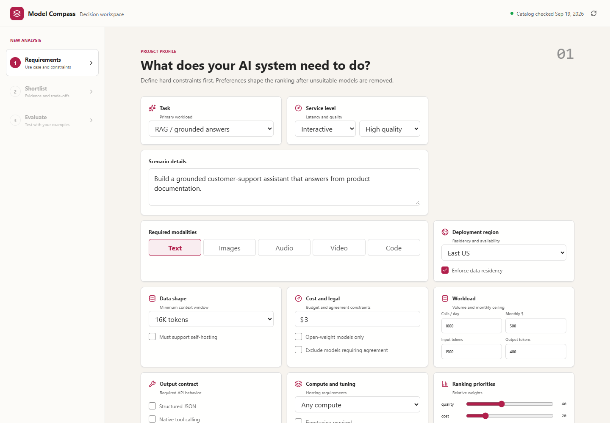
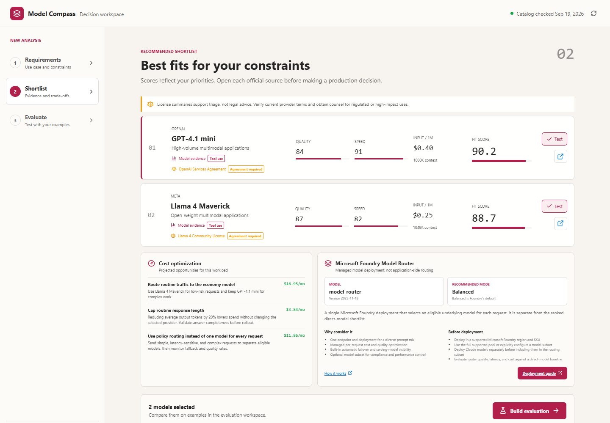
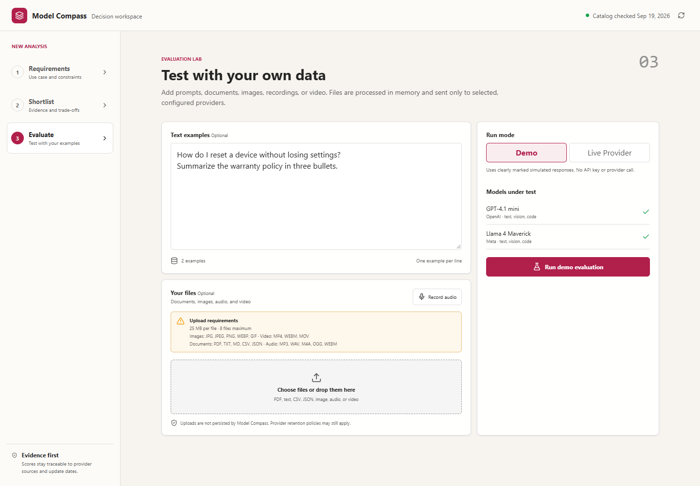

# Model Compass

Model Compass is a provider-neutral decision workspace for AI model discovery, constraint filtering, weighted comparison, and evaluation against representative project examples. It helps teams turn project requirements into an explainable shortlist, estimate operating cost, identify model lifecycle risk, and test candidates before committing to a provider.

It is a decision-support tool, not a benchmark authority, procurement system, or automatic production deployment service. Every recommendation exposes its assumptions and source links so a team can validate the result.

## Contents

- [What it does](#what-it-does)
- [How the workflow works](#how-the-workflow-works)
- [UI walkthrough](#ui-walkthrough)
- [Run locally](#run-locally)
- [Configure live evaluation](#configure-live-evaluation)
- [Recommendation logic](#recommendation-logic)
- [Microsoft Foundry Model Router](#microsoft-foundry-model-router)
- [Lifecycle and access governance](#lifecycle-and-access-governance)
- [API reference](#api-reference)
- [Architecture](#architecture)
- [Security and data handling](#security-and-data-handling)
- [Limitations](#limitations)
- [Troubleshooting](#troubleshooting)

## What it does

- Guided intake for use cases requiring one or several modalities, plus context, budget, region, residency, licensing, and self-hosting constraints
- Structured task type, latency tier, quality bar, daily volume, average token shape, and monthly budget ceiling
- Required output behavior for structured JSON, native tool calling, and streaming
- Managed endpoint or self-hosted GPU preference with fine-tuning requirements
- Transparent ranking across quality, cost, speed, and safety priorities
- Source-attributed model cards covering Microsoft, OpenAI, Anthropic, Google, Meta, Mistral AI, and DeepSeek
- Source-linked license, agreement, commercial-use, and legal-constraint summaries with an agreement filter
- Expandable model evidence covering shortlist reasons, normalized benchmark signals, tool use, speech-language support, and known weaknesses
- Compute guidance, approximate aggregate GPU memory, fine-tuning support, lifecycle status, and source-checked deprecation or retirement dates
- Projected cost optimization actions and a Microsoft Foundry Model Router deployment recommendation with Balanced, Cost, or Quality mode guidance
- Source-backed release dates, explicit gated-access status, and official provider or model access links
- Responsive comparison workspace with official source links
- Server-side evaluation runner for OpenAI-compatible provider endpoints
- User-data evaluation with text, PDF, CSV, JSON, images, audio recordings, and video
- Evaluation reports with input/output tokens, estimated cost, latency, and a quality/cost/latency weighted recommendation
- Explicit connector status when live inference is not configured

The included catalog is a dated baseline, not a claim of permanent availability or pricing. Production deployments should refresh metadata through provider adapters and retain the source URL, retrieval time, region, API version, and benchmark methodology for every value.

Catalog benchmark values are normalized comparison signals, not vendor benchmark claims. Each signal exposes its methodology and source. Speech languages are shown only where the catalog has explicit audio capability evidence, and known weaknesses are decision aids rather than exhaustive limitations.

Projected monthly cost uses calls per day, average input/output tokens, and catalog token prices. GPU memory is a planning floor that varies with precision, quantization, runtime, batching, and redundancy. Lifecycle dates remain empty until a provider publishes a source-backed date. Published notices are model-version specific; for example, the catalog marks Azure OpenAI GPT-4o `2024-05-13` as deprecated, retiring October 1, 2026, with GPT-5.1 as the published replacement.

Optimization savings are scenario estimates, not billing guarantees. They compare the highest-ranked eligible model with the lowest-cost eligible model and estimate a 20% output-token reduction. The Model Router panel describes Microsoft's deployable `model-router` feature, not client-side request classification: one Foundry endpoint selects an underlying model per request using Balanced, Cost, or Quality mode, optional model subsets, and managed failover. Availability, supported pools, deployment types, and regions must be confirmed in the linked current Microsoft documentation.

Gated access means the publisher requires an explicit license acceptance or repository access request. Ordinary account creation, project setup, account-tier availability, and regional availability are shown separately as provider onboarding and are not labeled gated. Access links point to official publisher or provider pages and should be rechecked before procurement or deployment.

## How the workflow works

1. **Describe the project.** Choose task type, required modalities, minimum context, deployment preference, region, latency and quality expectations, traffic shape, and budget.
2. **Set hard constraints.** Require capabilities such as structured JSON, tool calling, streaming, fine-tuning, self-hosting, data residency, or open weights.
3. **Tune priorities.** Weight quality, cost, speed, and safety according to the workload.
4. **Review the shortlist.** Model Compass removes candidates that fail hard constraints, then ranks the remaining models and explains each score.
5. **Inspect evidence and governance.** Expand cards to review benchmarks, known weaknesses, licensing, access requirements, compute guidance, and lifecycle notices.
6. **Review cost actions.** Compare projected monthly costs and practical savings opportunities.
7. **Consider Model Router.** For diverse Microsoft Foundry workloads, review the recommended `model-router` mode and deployment prerequisites.
8. **Evaluate finalists.** Select models and run representative prompts or files in deterministic Demo mode or through a configured live provider.
9. **Make the decision.** Compare outputs, observed latency, token usage, estimated cost, and the run verdict alongside human quality review.

## UI walkthrough

### 1. Define project requirements

Describe the workload, select required modalities, set deployment and legal constraints, estimate traffic, and tune ranking priorities.



### 2. Review the recommended shortlist

Compare eligible models, inspect fit scores and evidence, review projected cost optimizations, and evaluate Microsoft Foundry Model Router guidance.



### 3. Evaluate selected models

Test selected models with representative prompts or supported files, choose Demo or Live Provider mode, and compare the resulting operational metrics.



## Run locally

### Prerequisites

- [Node.js](https://nodejs.org/) 22 or later
- npm 10 or later
- [.NET SDK](https://dotnet.microsoft.com/download) 9.0
- A modern browser
- Optional: provider credentials for live evaluation

Clone and install the frontend dependencies:

```powershell
git clone https://github.com/ruba9/modelcompass.git
cd modelcompass
npm install --prefix client
```

Start the API:

```powershell
dotnet run --project server/ModelCompass.Api.csproj --launch-profile http
```

Start the client in a second terminal:

```powershell
npm run dev --prefix client
```

Open `http://localhost:5173`.

The API listens on `http://localhost:5070`. The Vite development server proxies no requests; the frontend calls that address directly. Both processes must be running for recommendations and evaluations to work.

### Production builds

Build both projects without starting them:

```powershell
dotnet build server/ModelCompass.Api.csproj
npm run build --prefix client
```

The frontend output is written to `client/dist`. This repository does not yet include production hosting infrastructure or automatic deployment configuration.

## Configure live evaluation

The evaluation screen defaults to **Demo**, which generates clearly labeled deterministic responses without contacting a provider. Switch to **Live provider**, then select Microsoft Foundry or OpenAI to use the corresponding server configuration below. The selected inference provider is independent of the model publisher.

Demo token counts use a character-based approximation plus an allowance for media assets; demo latency and cost are estimates. Live text evaluation reads OpenAI-compatible usage fields when the provider returns them and applies the catalog's separate input/output token prices. The post-run recommendation weights catalog quality at 55%, relative latency at 25%, and relative estimated cost at 20%. It is an operational comparison of that run, not proof of response correctness.

Credentials stay on the API server. Configure a provider with environment variables or .NET user secrets. The endpoint must accept an OpenAI-compatible chat completions payload.

```powershell
$env:Providers__OpenAI__Endpoint="https://api.openai.com/v1/chat/completions"
$env:Providers__OpenAI__ApiKey="<set in your terminal>"
$env:Providers__OpenAI__Authentication="ApiKey"
```

For a Microsoft Foundry or Azure OpenAI deployment using the OpenAI v1-compatible API:

```powershell
$env:Providers__Microsoft__Endpoint="https://<resource>.openai.azure.com/openai/v1/chat/completions"
$env:Providers__Microsoft__ApiKey="<set in your terminal>"
$env:Providers__Microsoft__Authentication="ApiKey"
$env:Providers__Microsoft__Models__gpt-4.1-mini="<deployment-name>"
```

Each selected catalog model needs a Microsoft deployment mapping in the form `Providers__Microsoft__Models__<model-id>`. A provider-wide `Providers__Microsoft__Model` is also supported as a fallback.

To use Microsoft Entra ID instead of an API key:

```powershell
az login
$env:Providers__Microsoft__Endpoint="https://<resource>.openai.azure.com/openai/v1/chat/completions"
$env:Providers__Microsoft__Authentication="EntraId"
$env:Providers__Microsoft__Models__gpt-4.1-mini="<deployment-name>"
```

Local Entra authentication uses `DefaultAzureCredential`. For Azure hosting, enable managed identity and assign it the `Cognitive Services OpenAI User` role on the Azure OpenAI resource. Restart the API after changing variables. Do not put provider keys in the React application or commit them to configuration files.

Multimodal evaluation uses a dedicated provider adapter because speech and media APIs do not share a universal payload. Configure its multipart endpoint separately:

```powershell
$env:Providers__Google__MediaEndpoint="https://your-adapter.example/evaluate"
$env:Providers__Google__ApiKey="<set in your terminal>"
```

The adapter receives `model`, JSON-encoded `samples`, and up to eight `files`, with a 25 MB limit per file. Supported formats are:

- Documents: PDF, TXT, MD, CSV, JSON
- Images: JPG, JPEG, PNG, WEBP, GIF
- Audio: MP3, WAV, M4A, OGG, WEBM
- Video: MP4, WEBM, MOV

The evaluation workspace checks every upload against the selected models before enabling a run. When a model does not support an uploaded text, vision, audio, or video modality, the UI names the incompatible model and data type. The API repeats format, size, count, and model-modality validation as a server-side safeguard. Files are processed in memory and are not persisted by this application; the configured provider's retention policy still applies.

## Recommendation logic

The recommendation endpoint applies hard filters before assigning any score. A model is excluded when it fails a required modality, context size, quality or latency floor, region or residency requirement, budget cap, deployment preference, legal constraint, or requested feature.

Eligible models receive a weighted score from catalog quality, estimated token cost, relative speed, safety, and task fit. The weights come directly from the requirements form. Deprecated models receive an additional penalty so they do not appear to be good choices for new projects solely because of historical capability scores.

Monthly estimates use:

$$
M_{calls} = C_{daily} \times 30
$$

$$
M_{cost} = M_{calls} \times \left(\frac{T_{input} P_{input}}{10^6} + \frac{T_{output} P_{output}}{10^6}\right)
$$

Prices and benchmark indexes are a dated catalog snapshot. They are intended for comparison and planning, not invoices or contractual guarantees.

## Microsoft Foundry Model Router

The Model Router panel refers specifically to the Microsoft Foundry `model-router` model feature. It does not create application-side rules such as "use model A for simple prompts and model B for hard prompts."

Model Router exposes one managed deployment and chooses a supported underlying model for each request. Model Compass recommends one of the documented routing modes based on the submitted weights:

- **Cost:** selected when cost is weighted above quality.
- **Quality:** selected when quality is weighted at more than twice cost.
- **Balanced:** selected for other profiles and is the Foundry default.

The panel links to Microsoft's current concept and deployment documentation. Before using it, confirm regional and SKU availability, decide whether to constrain the supported model subset, deploy Claude models separately when required, and compare router results against a fixed direct-model baseline.

## Lifecycle and access governance

Lifecycle metadata is model-version specific. A family name alone is not enough because versions can have different retirement schedules. Cards show the catalog check date, lifecycle state, retirement date, urgency, replacement model, and official source when Microsoft or another provider has published a notice.

The current snapshot includes Azure OpenAI GPT-4o `2024-05-13` as **Deprecated**, retiring **October 1, 2026**, with **GPT-5.1** as the published replacement. Model Compass reports 12 days remaining relative to the catalog check on September 19, 2026. Refresh this metadata before relying on it in production.

Access metadata distinguishes:

- **Gated access:** an explicit publisher license acceptance or repository approval is required.
- **Provider onboarding:** an ordinary account, project, subscription, deployment, or eligible region is required.
- **Open weights:** weights can be downloaded under the linked license, although a hosting service may add separate controls.

## Legal metadata

Each model card includes a source-linked license or provider agreement, commercial-use summary, agreement requirement, and notable constraints. The requirements screen can exclude models that require agreement acceptance. These summaries are for initial product triage, are not legal advice, and can become outdated; review the linked official terms and involve counsel for regulated, high-impact, or production use.

## API reference

### Health

`GET /api/health` returns API readiness and the catalog snapshot timestamp.

### Catalog

`GET /api/models` returns model cards and source references. Optional query parameters are `modality`, `region`, and `openSource`.

```powershell
Invoke-RestMethod "http://localhost:5070/api/models?modality=vision&openSource=true"
```

### Recommendations

`POST /api/recommendations` accepts project requirements and returns up to four ranked candidates, cost optimization actions, the Microsoft Foundry Model Router recommendation, and an explanation when no model passes every hard constraint.

```powershell
$body = @{
  taskType = "chat"
  modalities = @("text", "vision")
  minimumContext = 128000
  latencyRequirement = "interactive"
  qualityBar = "high"
  openSourceOnly = $false
  requireSelfHosting = $false
  requireDataResidency = $false
  region = "Global"
  maxInputCostPerMillion = $null
  computePreference = "any"
  requireFineTuning = $false
  requireStructuredJson = $true
  requireToolCalling = $true
  requireStreaming = $true
  excludeAgreementRequired = $false
  callsPerDay = 1000
  averageInputTokens = 1500
  averageOutputTokens = 400
  monthlyBudgetUsd = 500
  qualityWeight = 50
  costWeight = 25
  speedWeight = 15
  safetyWeight = 10
} | ConvertTo-Json

Invoke-RestMethod "http://localhost:5070/api/recommendations" `
  -Method Post -ContentType "application/json" -Body $body
```

### Text evaluation

`POST /api/evaluations` accepts `modelIds`, `samples`, `mode`, and `connection`. Use `mode: "demo"` without credentials or `mode: "live"` with `connection: "microsoft"` or `connection: "openai"`.

### Media evaluation

`POST /api/evaluations/media` accepts multipart form data with model IDs, samples, connection information, and up to eight supported files. Each file is limited to 25 MB and must use one of the document, image, audio, or video formats listed above.

## Architecture

- `client/`: React 19 and TypeScript decision workspace
- `server/`: ASP.NET Core minimal API, recommendation policy, model catalog, and provider evaluation boundary
- `GET /api/models`: filterable source-attributed catalog
- `POST /api/recommendations`: hard-constraint filtering and weighted ranking
- `POST /api/evaluations`: server-side sample execution with status, token usage, cost, latency, and a run verdict
- `POST /api/evaluations/media`: validated multipart media execution through provider adapters

The React client owns requirements capture, comparison, and result visualization. The ASP.NET Core API owns the catalog, filtering and scoring rules, cost estimates, provider credentials, and outbound inference calls. Keeping credentials and provider calls on the server prevents secret exposure in browser bundles.

## Security and data handling

- Never place provider keys in frontend code, committed settings, or the repository.
- Use environment variables, .NET user secrets, workload identity, or managed identity.
- Live prompts and files are sent to the provider endpoint selected by the user.
- Uploaded files are validated and held in memory by this app; they are not written to disk.
- Provider logging, abuse monitoring, and retention policies still apply after data leaves this application.
- Legal and license summaries are triage aids, not legal advice.
- Review acceptable-use policies and perform security, privacy, safety, and compliance assessments before production use.

## Limitations

- The built-in catalog is a manually curated snapshot rather than a live provider synchronization service.
- Prices, regions, model access, context limits, and retirement schedules can change.
- Catalog benchmark scores are normalized planning signals, not directly comparable vendor benchmark claims.
- Demo evaluation does not contact models and cannot measure actual answer quality.
- Live run verdicts combine catalog quality with observed cost and latency; they do not automatically grade correctness, groundedness, or safety.
- GPU memory values are approximate planning floors and depend on precision, quantization, runtime, batching, and redundancy.
- The project has no persistence, user accounts, organization policy store, telemetry backend, or production deployment templates.

## Troubleshooting

### The UI loads but recommendations fail

Confirm the API is running on port 5070 and that `http://localhost:5070/api/health` returns `status: ready`. If another process uses the port, update the API launch profile and the frontend API base URL together.

### Live evaluation says the connector is not configured

Set the endpoint, authentication mode, credential, and model deployment mapping in the same terminal session that starts the API. Restart the API after changing environment variables.

### A Microsoft model returns deployment-not-found

Catalog IDs are not necessarily deployment names. Configure `Providers__Microsoft__Models__<model-id>` with the deployment name created in your Foundry resource.

### Entra ID authentication fails

Run `az login` for local development, verify the active tenant and subscription, and assign the calling identity the `Cognitive Services OpenAI User` role on the resource. Managed identity should be used for Azure-hosted production workloads.

### No model meets the requirements

Relax one hard constraint at a time. Common blockers are an exact region, frontier quality combined with a low budget, self-hosting combined with managed-only models, or a required capability absent from the eligible catalog.

## Recommended next capabilities

1. Provider adapters for Microsoft Foundry, OpenAI, Google, Anthropic, and Hugging Face catalogs with scheduled refresh and schema validation.
2. Benchmark provenance that records dataset, benchmark version, evaluator, prompt template, and confidence interval.
3. Evaluation suites for groundedness, relevance, task success, safety, latency percentiles, throughput, token usage, and cost.
4. Side-by-side output review with blind human scoring, pairwise preference, comments, and exportable decision reports.
5. Organization policies for approved providers, regions, licenses, content filters, and maximum spend.
6. Historical snapshots, deprecation alerts, price-change notifications, and recommendation drift reports.
7. Retrieval and embedding model selection, image/audio models, fine-tuning suitability, and infrastructure sizing for self-hosted models.

Provider pages and catalog connectors remain the source of truth. A production refresh worker should ingest those sources into the same model-card schema, retain the checked timestamp, validate changes before publication, and alert when a lifecycle date or price changes; heterogeneous provider pages should not be scraped into production without provider-specific adapters and schema tests.
